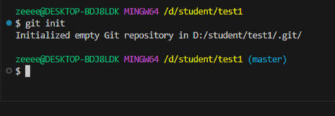
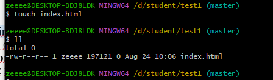
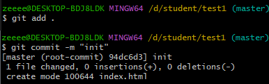

#### [НАЗАТ](readme.md)
## Перемещение между коммитами

Создадим новый проэкт 

добовляем файл index.html

Делаем первый комит

Cоздаем новую ветку develop. Создаватся будет из ветки мастер master 

         git checkout -b develop master  

    

