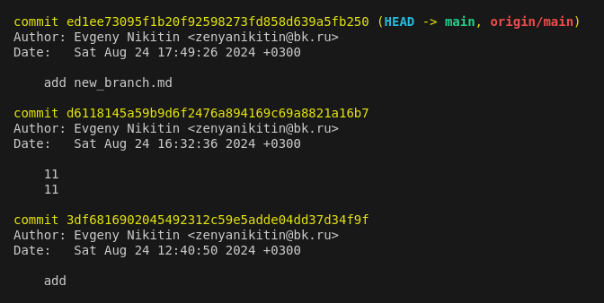
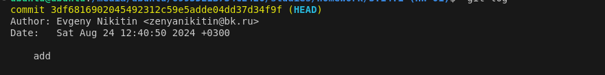

#### [НАЗАТ](readme.md)
## Перемещение между коммитами

**git log** - это команда, позволяющая просмотреть историю коммитов. Вывод команды git log  выглядит следующим образом:

**HEAD** — указатель на текущую версию проекта, которая находится в рабочей директории проекта.

С помощью команды  **git checkout**  можно перемещаться между комитами 

      git checkout '3df681'

