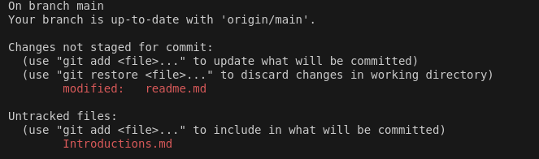
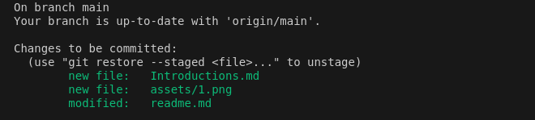
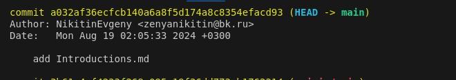

#### [НАЗАТ](readme.md)
## ВВедение

**Git** — это бесплатная распределенная система управления версиями с открытым исходным кодом, предназначенная для быстрой и эффективной обработки любых проектов: от небольших до очень крупных.

#### Git имеет три основных состояния, в которых могут находиться ваши файлы: 

1. **modified (модифицированный)** - означает, что вы изменили файл, но еще не сохранили его в базе данных. Файл находится в рабочий дерикотории (*Working Directory*).

2. **staged (подготовленный)** - означает, что вы отметили измененный файл в его текущей версии для включения в следующий снимок коммита. Файл находится в oбласти подготовки (*Staging Area*)

3. **commited (Зафиксированый)** - означает, что данные надежно хранятся в вашей локальной базе данных. Файл находится в каталоге GIT (*Git directory*).

#### Базовый рабочий процесс Git выглядит примерно так:

1. Вы изменяете файлы в своем рабочем проекте или добавляете новые 

    + Посмотреть в терминале статус файлов можно с помощью команды 
        
          git status
    
      
    + на рисунке мы видим два файла со статусом **модифицированый (modified)** и не **отслеживаемый (Untracked files)**. Статус Untracked означает, что Git видит файл, которого не было в предыдущем снимке состояния (коммите) - это новый файл.

2. Вы добавляете свои измененные файлы в область подготовки
    + Добавляем с помощью команды 

           git add [имя файла]

     + или командой каторая добавит все файлы 

            git add . 

    + после проверяем командой 
    
             git status

      

    + На рисунке видно три файла  со статусом **staged (подготовленный)** 

      

3. Вы делаете коммит, который берет файлы в том виде, в котором они находятся в области подготовки, и сохраняете этот снимок каталог Git.

   + Добовляем командой 

         git commit -m "commit message"

   + после проверяем командой  

          git status

      

