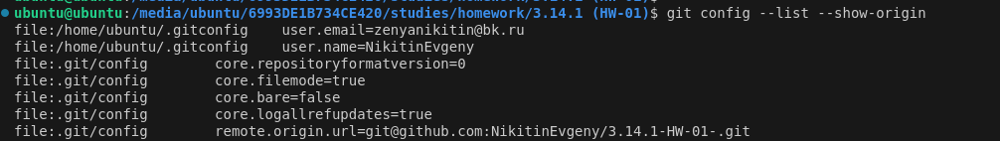
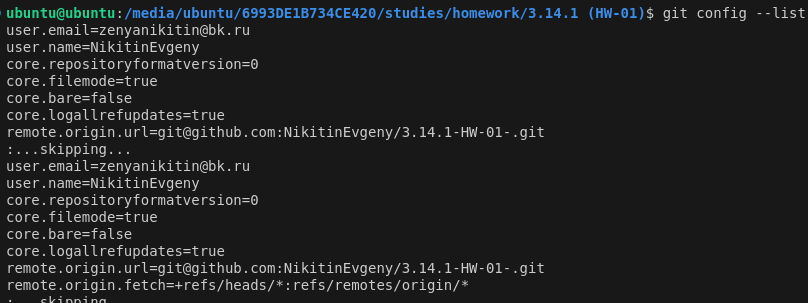

#### [НАЗАТ](readme.md)
## Hастройка

**git config** - утилита которая позволяет просматривать и настраивать параметры GIT.

Чтобы посмотреть все установленные настройки и узнать где именно они заданы, используйте команду:

    git config --list --show-origin

чтобы показать все настройки используйте команду:

    git config --list

Укажем  имя и адрес электронной почты.

    $ git config --global user.name "John Doe"
    $ git config --global user.email johndoe@example.com

При инициализации  репозитория командой git init, Git создаёт ветку с именем master по умолчанию. чтобы установить имя main для вашей ветки по умолчанию, выполните следующую команду:

    git config --global init.defaultBranch main

