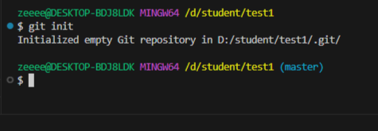
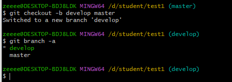
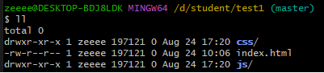

#### [НАЗАТ](readme.md)
## Новая ветка

Создадим новый проект 

добавляем файл index.html

Делаем первый комит

Cоздаем новую ветку develop. Она создаётся  из ветки  master 

         git checkout -b develop master  

Проверяем сколько у нас веток  

         git branch -a

Мы видим что у на две ветки Develop и master. Активная ветка Develop.

давайте создадим в этой ветки еще две паки js и css

         mkdir js css

и проверим с помощью команды 
      
        ll

Делаем комит и переходим в ветку master. Для того что перейти в ветку master используем команду  

         git switch master

проверяем какие файлы у нас содержит ветка  master

         ll

 

 Давайте сольем ветку  develop в  ветку  master 

         git merge develop

 

 Проверяем файлы в ветки master

          ll

 

    

    

