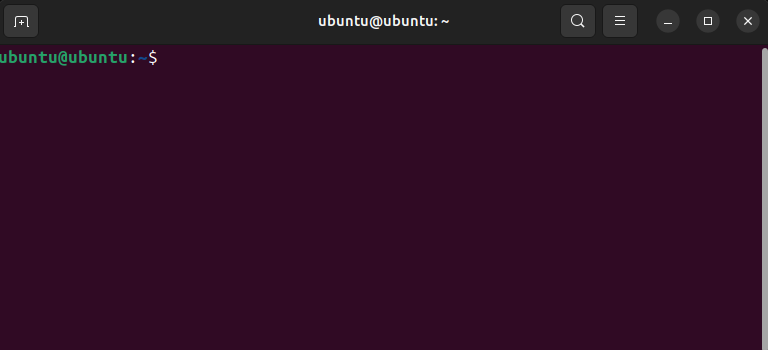
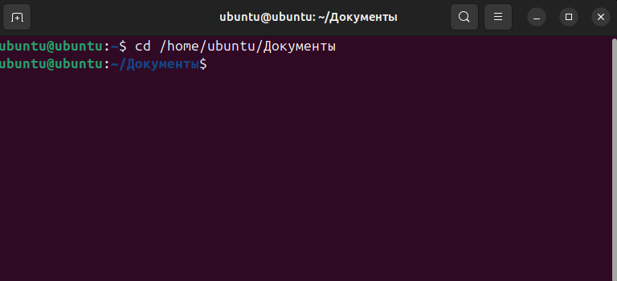
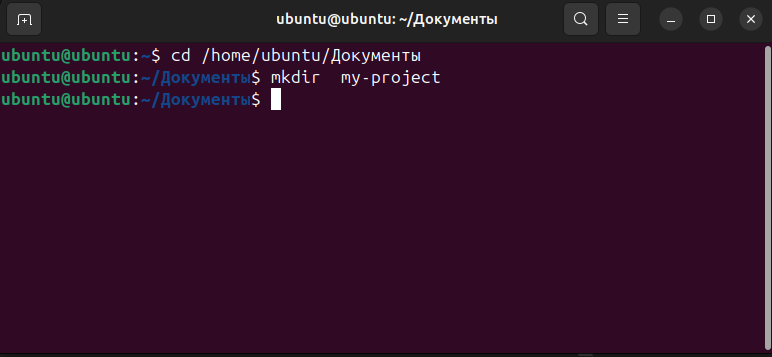
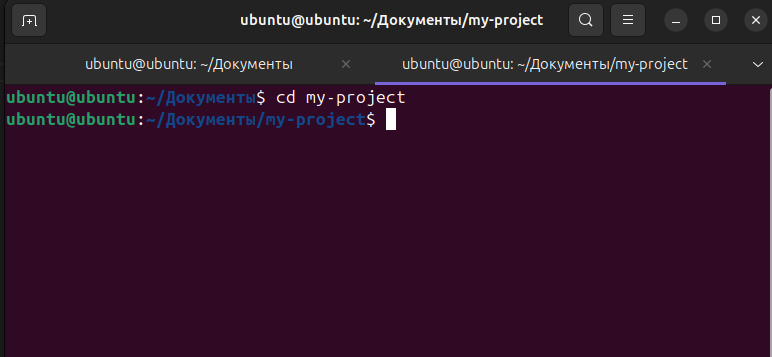
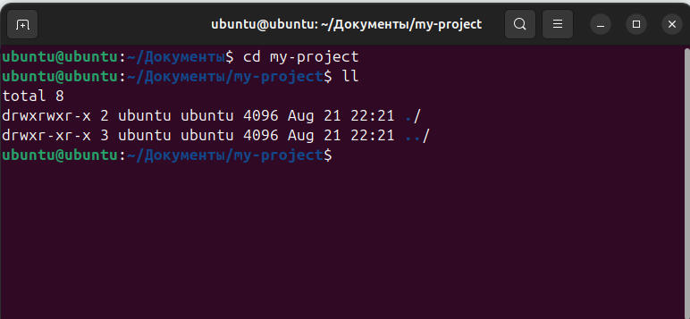
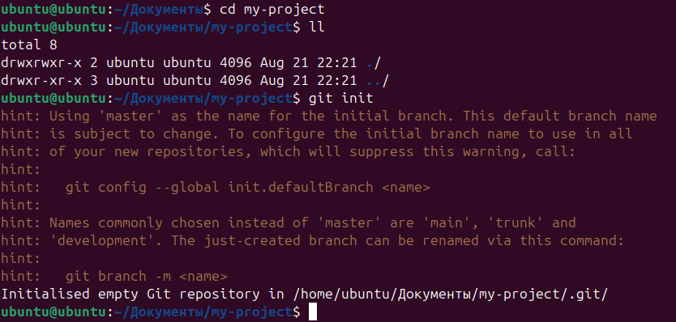
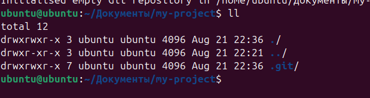

#### [НАЗАТ](readme.md)
## добавления нового репозитория 

Для создания нового репозитория используется команда **git init**. Команду **git init** выполняют только один раз для первоначальной настройки нового репозитория.
После создания нового репозитория в папке вашего проекта появится скрытая папка .git. 

Давайте создадим новую папку для нашего проекта. Я использую операционную системуLinux (Ubuntu ).

Я буду создавать свой проэкт в папке Документы. Перейдем в эту папку с помощью команды:
 *cd /home/ubuntu/Документы*
 
 

 Далее командой: *mkdir* создадим папку  *my-project*
 
 

 Переходим в созданную папку: *cd my-project*

  

  Данная папка сейчас пустая и мы можем в этом убедится с помощью команды: *ll*

  

  Создаем новый репозиторий Git c помощью команды: *git init*

  

  Проверяем той же командой: *ll*

  

  Отлично, мы видем что скрытая папка .git у нас есть.

